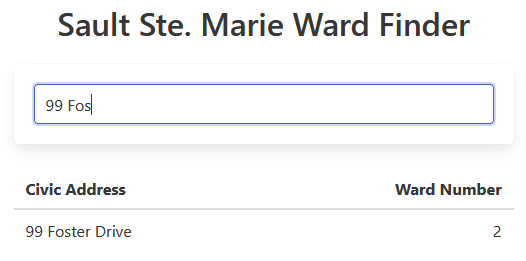

# Sault Ste. Marie Ward Finder

A simple tool to find out the ward number for an address in Sault Ste. Marie, Ontario.

**[Find Your Ward Number Now](https://cityssm.github.io/ward-finder/)**

## Licence Note

Note that although all of the code is free to use,
the logo images (starting with "logo-")
are the property of their respective entities.

## Related Links

-   Find out more about the [2022 Municipal Election](https://saultstemarie.ca/Government/City-Departments/Corporate-Services/City-Clerk/Municipal-Election.aspx).

-   Address and ward data can be found in the
    [cityssm/soomaps-data](https://github.com/cityssm/soomaps-data) repository.

-   Find your ward visually with [SooMaps.com](https://www.soomaps.com/).

-   View [ward maps on SaultSteMarie.ca](https://saultstemarie.ca/Government/City-Departments/Corporate-Services/City-Clerk/Ward-Boundaries.aspx).
